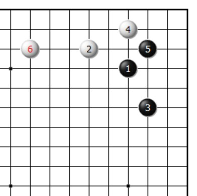

Go (Weiqi)
=================

.. important::
   
   I was certified of amateur 1 Dan many years ago. Over the years, I just played against others and did not continue to study systematically and deeply. I am not sure if my Go level has improved, especially in the context of the huge changes that AI has brought to Go over the years.

I started learning Go when I was in elementary school. Despite not having studied for a particularly long time, I finished my studies with an amateur 1 Dan certificate and won the sixth place in the city's junior Go competition.

The picture below shows the first Go joseki (定式) I learned when I was young. This joseki is now almost obsolete due to the new theory proposed by AlphaGo_ and other Go AIs.

When I was learning Go, the strongest player in the world is probably Lee Chang-ho (李昌镐, 1975--), but my favorite is the power player Sakata Eio (坂田荣男, 1920--2010). This is because my style of play has always been conservative and steady; I have purchased many of his games in the hope of breaking through. Mr. Sakata fought in the Go world until he was 80 years old and could be said to be a reflection of the fighting spirit of Go. I was very sad when he passed away in 2010. 

Among the new generation of Go players, I now like Gu Zihao (辜梓豪, 1998--), perhaps the most aggressive and powerful Chinese Go player of the new generation. By the way, he was also born in Hubei, so I have a sense of hometown affinity.

In my spare time, I still play Go on `KGS Go (CGoban)`_ and `Foxwq`_ (野狐围棋) with other online players. In 2021, I was rated at 3~4 Dan level (we all understand that these platforms tend to rate users' levels on the high side).

.. _AlphaGo: https://deepmind.com/research/case-studies/alphago-the-story-so-far
.. _Foxwq: https://www.foxwq.com/soft.html
.. _KGS Go (CGoban): https://www.gokgs.com/