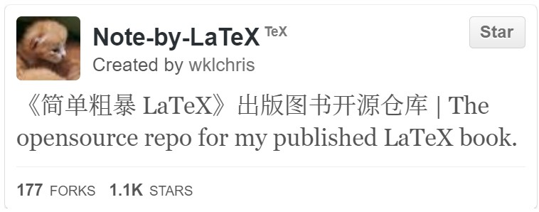
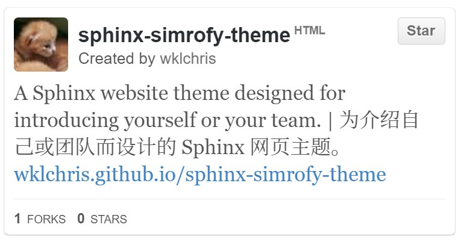

Computer \& Programming
=============================

.. important::
   
   Now I mainly use Python/C++, and I rarely use Pascal/C# that I learned before. I also know HTML/CSS and a little Javascript, otherwise I wouldn't have been able to write this site.
   
   If you consider LaTeX a programming language, I'm a heavy LaTeX user too. See my published book on how to use LaTeX (Github repo: `wklchris/Note-by-LaTeX`_). 

Yes, that's right, of course. Programming has been my biggest passion for a long time, and I'm happy to see that. Here are my representative Github projects, you can also access my Github home page via the Github icon in the top right corner of the page (thanks `lepture/github-cards <https://github.com/lepture/github-cards>`_ for repo cards rendering):

* Around 2000 (at the age of about 6), I was introduced to computers. I was very fortunate to be exposed to and interested in computers at a very young age, especially against the backdrop of the slow penetration of computers in China at that time.

* In 2004, I started learning programming. Pascal_ was the first language I came across in my life, learning it in a Delphi_ environment. 

  Around 2008, I went to Wuhan, Hubei to participate in the provincial Olympiad in Informatics, but I only got a city-level third prize.

* During 2012-2014, I enrolled Visual Basic, C++ courses in Tongji. I also self-learned data structures and algorithms during that time.
* Around 2015, I learned about Github and register an account.
  
  * I began to share my LaTeX learning notes on Github (`wklchris/Note-by-LaTeX`_), and compiled them into a book and publish them in 2020.
  * I built my personal website at that time and learned HTML/CSS/Javascript by building the website.
  * I self-learned `Python 3`_ and quickly fell in love with its simplicity and ease of use.

* In 2018, I took advanced algorithm courses and a `D3.js`_ visualization course. 

.. _D3.js: https://d3js.org/
.. _Delphi: https://en.wikipedia.org/wiki/Delphi_(software)
.. _Pascal: https://en.wikipedia.org/wiki/Pascal_(programming_language)
.. _Python 3: https://www.python.org/
.. _Sega: https://en.wikipedia.org/wiki/Sega
.. _Virtua Cop: https://en.wikipedia.org/wiki/Virtua_Cop
.. _wklchris/Note-by-LaTeX: https://github.com/wklchris/Note-by-LaTeX