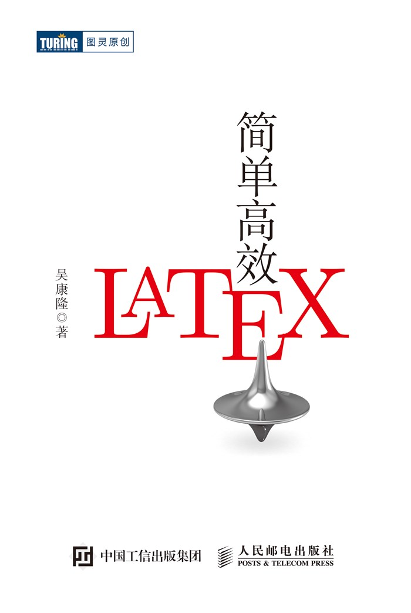
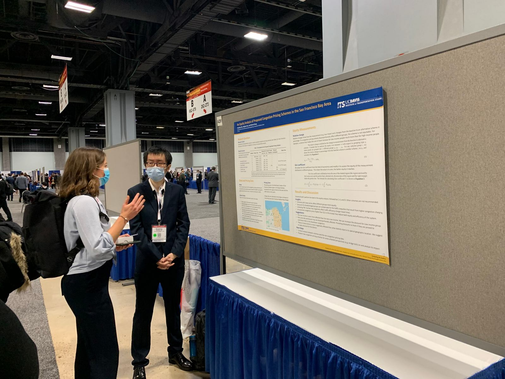

Publications
============================

I am mostly interested in traffic operations and now am pursuing the PhD degree with a dissertation topic of transit bus operation.

Published Books
----------------------

I have a published book (in Chinese) about the use of LaTeX, and the book itself is also typeset in LaTeX. Its source code is available in my Github repo: `wklchris/Note-by-LaTeX <https://https://github.com/wklchris/Note-by-LaTeX>`_ .

    The cover picture of my published LaTeX book (Picture from iTuring)

.. bibliography:: refs.bib
    :filter: type == "book"

The book is avaliable on `JD <https://item.jd.com/12925624.html>`_, `Dangdang <http://product.dangdang.com/28989929.html>`_, and `iTuring <https://www.ituring.com.cn/book/2685>`_.

Articles, Reports, \& Inproceedings
-----------------------------------------

    Me hosting my poster session at the 101st TRB meeting, Washington D.C, 2022.

-----

Here are my academic publications.

.. bibliography:: refs.bib
    :filter: not (type == "book")

